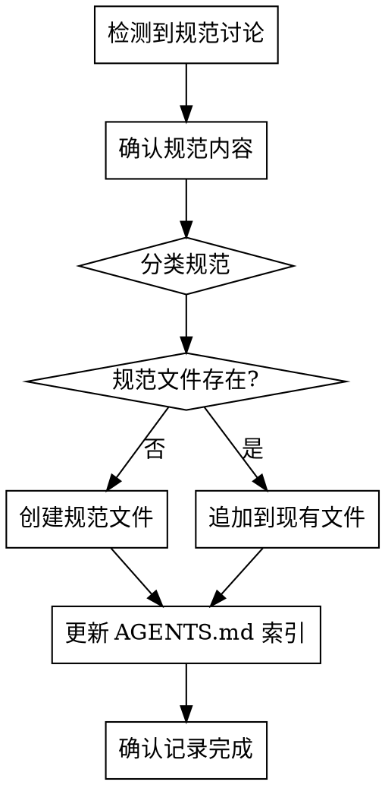
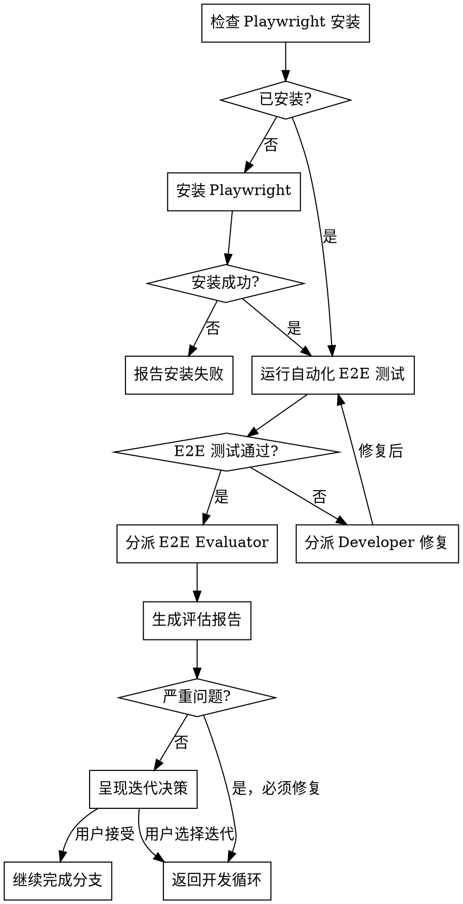
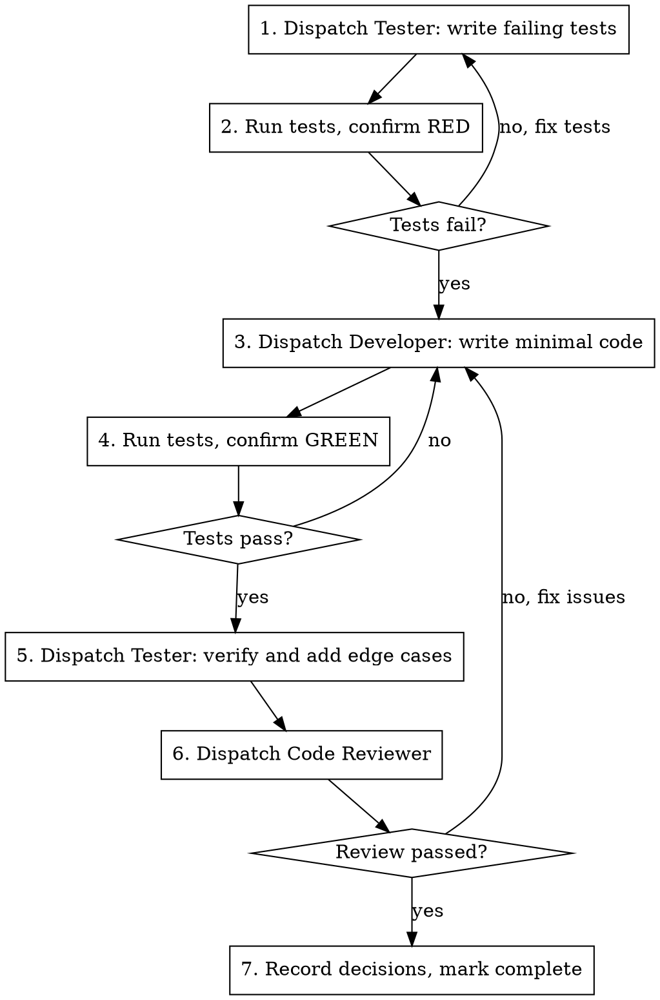

# Enterprise Development Workflow Implementation Plan

> **For agentic workers:** REQUIRED SUB-SKILL: Use superpowers:subagent-driven-development (recommended) or superpowers:executing-plans to implement this plan task-by-task. Steps use checkbox (`- [ ]`) syntax for tracking.

**Goal:** 为 Superpowers 添加企业级开发能力，包括文档沉淀、角色分离、端到端评估、规范记录和知识索引。

**Architecture:** 通过扩展现有 Skills 和新增 Skills 实现。新增 4 个 Skill 文件和 2 个 Prompt 模板，修改 8 个现有 Skill。所有改动都是 Markdown 指令文档，无需编译或测试框架。

**Tech Stack:** Markdown, Graphviz DOT (流程图), Git

**Spec:** `docs/superpowers/specs/2026-03-30-enterprise-development-workflow-design.md`

---

## File Structure

| File | Responsibility | Action |
|------|----------------|--------|
| `skills/development-documentation/report-templates.md` | 报告模板参考 | Create |
| `skills/convention-tracking/SKILL.md` | 规范记录技能 | Create |
| `skills/e2e-evaluation/SKILL.md` | 端到端评估技能 | Create |
| `skills/e2e-evaluation/evaluator-prompt.md` | E2E 评估者 Prompt | Create |
| `skills/subagent-driven-development/tester-prompt.md` | Tester 角色 Prompt | Create |
| `skills/subagent-driven-development/developer-prompt.md` | Developer 角色 Prompt | Rename + Modify |
| `skills/subagent-driven-development/SKILL.md` | 子代理驱动开发 | Modify |
| `skills/executing-plans/SKILL.md` | 计划执行 | Modify |
| `skills/systematic-debugging/SKILL.md` | 系统性调试 | Modify |
| `skills/finishing-a-development-branch/SKILL.md` | 分支完成 | Modify |
| `skills/brainstorming/SKILL.md` | 头脑风暴 | Modify |
| `skills/writing-plans/SKILL.md` | 计划编写 | Modify |
| `skills/using-superpowers/SKILL.md` | 技能系统入口 | Modify |
| `AGENTS.md` | 项目知识索引模板 | Create |

---

## Task 1: 创建报告模板参考文件

**Files:**
- Create: `skills/development-documentation/report-templates.md`

- [ ] **Step 1: 创建 development-documentation 目录和报告模板文件**

```markdown
---
name: development-documentation
description: Reference templates for development reports - used by subagent-driven-development and finishing-a-development-branch
---

# Development Report Templates

报告模板参考，供 subagent-driven-development、executing-plans、systematic-debugging、finishing-a-development-branch 技能使用。

## 目录结构

```
docs/superpowers/reports/YYYY-MM-DD-<feature-name>/
├── decisions.md      # 实时追加
├── implementation.md # 完成时生成
├── tests.md          # 完成时生成
├── evaluation.md     # E2E 评估后生成
└── summary.md        # 完成时生成
```

## 报告目录命名

从 plan 文件名提取：
- Plan: `docs/superpowers/plans/2026-03-30-user-authentication.md`
- Report: `docs/superpowers/reports/2026-03-30-user-authentication/`

---

## decisions.md 模板

实时追加，每次遇到关键决策、问题或选择时记录。

```markdown
# 决策日志

## [YYYY-MM-DD HH:MM] 任务 N: <任务名称>

### 问题/背景
<遇到了什么问题或需要做什么决策>

### 考虑的选项
1. <选项A> — <优缺点>
2. <选项B> — <优缺点>

### 决策
<最终选择及理由>

### 影响
<这个决策对后续开发的影响>

---
```

**触发时机:**
- 实现者报告 DONE_WITH_CONCERNS
- 任务经历 BLOCKED → 重新调度
- systematic-debugging 完成根因分析
- 任何需要人工介入的决策点

---

## tests.md 模板

完成时生成，记录测试覆盖和结果。

```markdown
# 测试报告

**生成时间:** YYYY-MM-DD HH:MM
**关联计划:** [<plan-name>](../plans/YYYY-MM-DD-<feature>.md)

## 测试覆盖

| 模块 | 测试用例数 | 通过 | 失败 | 覆盖率 |
|------|-----------|------|------|--------|
| ... | ... | ... | ... | ...% |

## 单元测试用例

- [x] `test_xxx` — 验证 xxx 功能
- [x] `test_yyy` — 验证 yyy 功能

## 集成测试用例

- [x] `test_integration_xxx` — 验证 xxx 集成

## 端到端测试

**Playwright 版本:** x.x.x

### E2E 测试用例
- [x] `login-flow.spec.ts` — 用户登录流程
- [x] `checkout.spec.ts` — 购物结账流程

## 测试命令

```bash
<实际运行的测试命令>
```

## 测试输出

```
<测试运行的关键输出>
```
```

---

## implementation.md 模板

完成时生成，记录实现细节。

```markdown
# 实现报告

**完成时间:** YYYY-MM-DD HH:MM
**关联规范:** [<spec-name>](../specs/YYYY-MM-DD-<feature>-design.md)
**关联计划:** [<plan-name>](../plans/YYYY-MM-DD-<feature>.md)

## 变更概览

| 文件 | 变更类型 | 说明 |
|------|----------|------|
| `src/xxx.ts` | 新增 | xxx 实现 |
| `src/yyy.ts` | 修改 | 添加 yyy 功能 |

## 关键实现

### <模块1名称>
<实现要点、核心逻辑说明>

### <模块2名称>
<实现要点、核心逻辑说明>

## 与计划的偏差

<如有偏离计划的地方，说明原因；如无则写"无">

## 后续建议

<未来可能的优化方向>
```

---

## evaluation.md 模板

E2E 评估后生成，记录全面评估结果。

```markdown
# 端到端评估报告

**评估时间:** YYYY-MM-DD HH:MM
**评估者:** E2E Evaluator Agent

## 评估总结

| 维度 | 评分 | 说明 |
|------|------|------|
| 功能完整性 | ⭐⭐⭐⭐⭐ | 所有功能按预期工作 |
| 流程连贯性 | ⭐⭐⭐⭐☆ | ... |
| 交互体验 | ⭐⭐⭐⭐☆ | ... |
| 一致性 | ⭐⭐⭐⭐⭐ | ... |
| 可用性 | ⭐⭐⭐⭐☆ | ... |

**整体评分:** X.X/5
**发布建议:** ✅ 可发布 / ⚠️ 建议修复后发布 / ❌ 需要迭代

## 问题清单

### 🔴 严重问题（必须修复）
<无 / 问题列表>

### 🟡 中等问题（建议修复）
1. **问题:** <问题描述>
   - **影响:** <影响范围>
   - **建议:** <修复建议>

### 🟢 轻微问题（可选修复）
1. **问题:** <问题描述>
   - **建议:** <优化建议>

## 亮点

<做得好的地方>

## 迭代决策

**是否需要迭代:** 是 / 否

**如需迭代，任务清单:**
- [ ] <迭代任务1>
- [ ] <迭代任务2>

**预计迭代工作量:** ~X 小时
```

---

## summary.md 模板

完成时生成，汇总所有文档。

```markdown
# 功能开发总结: <功能名称>

**开发周期:** YYYY-MM-DD ~ YYYY-MM-DD
**状态:** ✅ 完成 / ⚠️ 部分完成

## 文档索引

| 文档 | 说明 |
|------|------|
| [设计规范](../specs/YYYY-MM-DD-<feature>-design.md) | 需求和架构设计 |
| [实现计划](../plans/YYYY-MM-DD-<feature>.md) | 任务分解和执行步骤 |
| [实现报告](./implementation.md) | 代码变更记录 |
| [测试报告](./tests.md) | 测试覆盖和结果 |
| [评估报告](./evaluation.md) | E2E 评估结果 |
| [决策日志](./decisions.md) | 开发过程中的关键决策 |

## 功能摘要

<一段话描述这个功能做了什么>

## 关键指标

| 指标 | 值 |
|------|-----|
| 任务数 | N |
| 修改文件数 | N |
| 新增代码行 | ~N |
| 测试用例数 | N |
| 测试覆盖率 | N% |
| E2E 评分 | X.X/5 |

## 学习要点

<这次开发中值得记录的经验教训>
```

---

## 使用指南

### 何时创建报告目录

- **subagent-driven-development:** 读取 plan 后立即创建
- **executing-plans:** 开始执行前创建

### 何时追加 decisions.md

- 实现者报告 DONE_WITH_CONCERNS
- 任务经历 BLOCKED → 重新调度
- systematic-debugging 完成根因分析
- 任何需要人工介入的决策

### 何时生成完整报告

- **finishing-a-development-branch** Step 1.5
```

- [ ] **Step 2: 提交文件**

```bash
git add skills/development-documentation/report-templates.md
git commit -m "feat: add development documentation report templates"
```

---

## Task 2: 创建规范记录技能

**Files:**
- Create: `skills/convention-tracking/SKILL.md`

- [ ] **Step 1: 创建 convention-tracking 目录和 SKILL.md**

```markdown
---
name: convention-tracking
description: Use when discussing and establishing project conventions, coding standards, or workflow rules - automatically records agreed conventions to docs/conventions/
---

# Convention Tracking

## Overview

在任意对话中，当与用户讨论并确定项目规范时，自动记录到 `docs/conventions/` 目录。

**Core principle:** 规范应该被记录下来，而不是依赖记忆。

## When to Activate

检测到以下情况时主动记录：

- 用户明确表达偏好（"我希望..."、"以后都要..."、"请记住..."）
- 讨论确定了技术选型（"我们用 X 而不是 Y"）
- 约定了命名规范、代码风格
- 确定了流程或工作方式
- 用户纠正了之前的做法（"不要这样做，应该..."）

## Convention Categories

| 类别 | 文件 | 内容示例 |
|------|------|----------|
| 代码风格 | `docs/conventions/code-style.md` | 缩进、括号、空行规则 |
| 命名约定 | `docs/conventions/naming.md` | 变量、函数、文件命名 |
| Git 工作流 | `docs/conventions/git-workflow.md` | 分支策略、提交规范 |
| 测试规范 | `docs/conventions/testing.md` | 测试策略、覆盖率要求 |
| API 设计 | `docs/conventions/api-design.md` | 接口设计原则 |
| 其他 | `docs/conventions/<topic>.md` | 项目特定规范 |

## The Process



## Convention Format

每条规范使用以下格式：

```markdown
## [规范名称]

**来源:** [YYYY-MM-DD] / [功能开发名称或对话主题]
**状态:** 生效中 / 已废弃

### 规范内容

<具体规范描述>

### 背景

<为什么确定这个规范>

### 示例

**正确:**
```
<正确示例>
```

**错误:**
```
<错误示例>
```

---
```

## Creating New Convention Files

当需要创建新的规范文件时：

```markdown
# [类别名称] 规范

本文件记录项目的 [类别] 相关规范。

---

## [第一条规范]

...
```

## Integration with AGENTS.md

每次添加新规范时，检查 `AGENTS.md` 中是否有对应的链接：

1. 如果是新创建的规范文件 → 添加到 AGENTS.md 的规范表格
2. 如果是追加到现有文件 → 无需更新 AGENTS.md

## Key Principles

- **主动记录** — 不等用户要求，检测到规范讨论就记录
- **确认内容** — 记录前向用户确认规范内容是否准确
- **分类清晰** — 将规范放入正确的类别文件
- **保持索引** — 确保 AGENTS.md 索引是最新的

## Red Flags

- 规范讨论后没有记录
- 规范记录在错误的类别
- AGENTS.md 缺少新规范文件的链接
- 规范内容模糊，没有具体示例
```

- [ ] **Step 2: 提交文件**

```bash
git add skills/convention-tracking/SKILL.md
git commit -m "feat: add convention-tracking skill for recording project conventions"
```

---

## Task 3: 创建端到端评估技能

**Files:**
- Create: `skills/e2e-evaluation/SKILL.md`
- Create: `skills/e2e-evaluation/evaluator-prompt.md`

- [ ] **Step 1: 创建 e2e-evaluation 目录和 SKILL.md**

```markdown
---
name: e2e-evaluation
description: Use after all unit tests pass, before finishing a development branch - runs E2E tests and performs comprehensive evaluation of functionality, flow, and user experience
---

# End-to-End Evaluation

## Overview

在所有单元测试通过后，运行端到端测试并进行全面评估。不仅是自动化测试，还包括功能完整性、流程连贯性、交互体验等全方位评估。

**Core principle:** 端到端评估是发布前的最后一道质量关卡。

**Announce at start:** "I'm using the e2e-evaluation skill to perform comprehensive evaluation."

## When to Use

- `finishing-a-development-branch` 中，Step 1（验证单元测试）之后
- 用户显式请求端到端评估
- 重大功能完成后的验收测试

## Evaluation Dimensions

| 维度 | 评估内容 |
|------|----------|
| **功能完整性** | 所有功能是否按预期工作 |
| **流程连贯性** | 用户旅程是否顺畅，步骤是否合理 |
| **交互体验** | 响应速度、错误提示、边界处理 |
| **一致性** | UI 风格、命名、行为是否一致 |
| **可用性** | 潜在的用户困惑点、痛点 |

## The Process



## Step 1: Prerequisites Check

### 检查 Playwright 安装

```bash
npx playwright --version
```

### 如果未安装

1. 读取安装指南：https://raw.githubusercontent.com/microsoft/playwright-cli/refs/heads/main/README.md
2. 执行安装：
   ```bash
   npm init playwright@latest
   npx playwright install
   ```
3. 验证安装成功

## Step 2: Run Automated E2E Tests

```bash
npx playwright test
```

**如果测试失败:**
1. 分析失败原因
2. 分派 Developer 修复
3. 重新运行测试

## Step 3: Dispatch E2E Evaluator

使用 `evaluator-prompt.md` 模板分派评估子代理。

评估者将检查：
- 功能完整性
- 流程连贯性
- 交互体验
- 一致性
- 可用性问题

## Step 4: Generate Evaluation Report

将评估结果写入 `evaluation.md`，参考 `development-documentation/report-templates.md` 中的模板。

## Step 5: Iteration Decision

根据评估结果呈现决策：

```
端到端评估完成。

评估结果: ⭐⭐⭐⭐☆ (X.X/5)
- 🔴 严重问题: N
- 🟡 中等问题: N
- 🟢 轻微问题: N

建议: [发布建议]

您想要:
1. 进入迭代 — 修复问题，然后重新评估
2. 接受当前状态 — 继续完成分支
3. 只修复严重问题 — 快速修复后继续

请选择:
```

## Issue Severity

| 级别 | 定义 | 处理方式 |
|------|------|----------|
| 🔴 严重 | 影响核心功能，用户无法完成主要任务 | 必须修复，自动进入迭代 |
| 🟡 中等 | 影响用户体验，但不阻塞核心功能 | 建议修复，用户决定 |
| 🟢 轻微 | 优化建议，不影响功能 | 可选修复，记录到后续计划 |

## Integration

**Called by:**
- `finishing-a-development-branch` (Step 1.2)

**Outputs:**
- `evaluation.md` 评估报告
- 更新 `tests.md` 的 E2E 测试部分
```

- [ ] **Step 2: 创建 evaluator-prompt.md**

```markdown
# E2E Evaluator Prompt Template

Use this template when dispatching an E2E evaluator subagent.

```
Task tool (general-purpose):
  description: "E2E Evaluation for: [feature name]"
  prompt: |
    You are a senior product experience evaluator. Perform comprehensive evaluation
    of the completed feature.

    ## Feature Context

    [Brief description of the feature being evaluated]

    ## Evaluation Checklist

    ### 1. 功能完整性
    - [ ] 所有计划中的功能是否都已实现？
    - [ ] 功能是否按规范预期工作？
    - [ ] 边界情况是否正确处理？
    - [ ] 错误情况是否有适当的处理？

    ### 2. 流程连贯性
    - [ ] 用户完成核心任务的步骤是否最优？
    - [ ] 流程中是否有断点或困惑点？
    - [ ] 错误恢复路径是否清晰？
    - [ ] 步骤之间的转换是否自然？

    ### 3. 交互体验
    - [ ] 响应速度是否可接受？（<200ms 良好，<500ms 可接受）
    - [ ] 加载状态、进度反馈是否充分？
    - [ ] 错误提示是否友好且可操作？
    - [ ] 操作确认和撤销是否合理？
    - [ ] 键盘导航是否支持？

    ### 4. 一致性
    - [ ] 命名和术语是否统一？
    - [ ] 类似操作的行为是否一致？
    - [ ] 视觉风格是否协调？
    - [ ] 错误消息格式是否一致？

    ### 5. 可用性问题
    - [ ] 是否有潜在的用户困惑点？
    - [ ] 是否有可预见的常见错误？
    - [ ] 文档/帮助是否充分？
    - [ ] 首次使用的引导是否足够？

    ## Report Format

    ### 评估总结

    | 维度 | 评分 (1-5) | 说明 |
    |------|------------|------|
    | 功能完整性 | ⭐... | ... |
    | 流程连贯性 | ⭐... | ... |
    | 交互体验 | ⭐... | ... |
    | 一致性 | ⭐... | ... |
    | 可用性 | ⭐... | ... |

    **整体评分:** X.X/5
    **发布建议:** ✅ 可发布 / ⚠️ 建议修复后发布 / ❌ 需要迭代

    ### 问题清单

    **🔴 严重问题:**
    (列出所有严重问题，每个包含问题描述、影响范围、建议修复方案)

    **🟡 中等问题:**
    (列出所有中等问题)

    **🟢 轻微问题:**
    (列出所有轻微问题)

    ### 亮点
    (做得好的地方)

    ### 迭代建议
    (下一版本可考虑的改进)
```
```

- [ ] **Step 3: 提交文件**

```bash
git add skills/e2e-evaluation/
git commit -m "feat: add e2e-evaluation skill for comprehensive end-to-end evaluation"
```

---

## Task 4: 创建 Tester 角色 Prompt

**Files:**
- Create: `skills/subagent-driven-development/tester-prompt.md`

- [ ] **Step 1: 创建 tester-prompt.md**

```markdown
# Tester Subagent Prompt Template

Use this template when dispatching a tester subagent in strict TDD workflow.

## Phase 1: Writing Failing Tests

```
Task tool (general-purpose):
  description: "Write failing tests for Task N: [task name]"
  prompt: |
    You are a Tester writing failing tests for a feature.

    ## Task Description

    [FULL TEXT of task from plan]

    ## Context

    [Relevant files, architecture context]

    ## Your Job

    Write tests that:
    1. Cover the expected behavior described in the task
    2. Cover edge cases and error conditions
    3. MUST FAIL when run (the implementation doesn't exist yet)

    ## Test Design Principles

    - Test behavior, not implementation
    - Each test should test ONE thing
    - Use descriptive test names that explain what's being tested
    - Include setup, action, and assertion sections
    - Consider: happy path, edge cases, error cases

    ## Before You Finish

    Self-review:
    - [ ] Tests cover all requirements in the task
    - [ ] Tests are independent (no shared state)
    - [ ] Test names clearly describe expected behavior
    - [ ] Edge cases are covered
    - [ ] Error conditions are tested

    ## Report Format

    - **Status:** DONE | NEEDS_CONTEXT | BLOCKED
    - Tests written (file paths and test names)
    - Expected failure messages
    - Any questions or concerns
```

## Phase 2: Verifying and Adding Edge Case Tests

```
Task tool (general-purpose):
  description: "Verify tests and add edge cases for Task N: [task name]"
  prompt: |
    You are a Tester verifying that tests pass and adding edge case coverage.

    ## Context

    The Developer has implemented the feature. All existing tests should pass.

    ## Your Job

    1. Run existing tests to confirm they pass
    2. Review implementation for untested edge cases
    3. Add additional tests for:
       - Boundary conditions
       - Error handling
       - Edge cases not covered initially

    ## Report Format

    - **Status:** DONE | NEEDS_FIXES | BLOCKED
    - Test run results
    - New tests added (if any)
    - Coverage assessment
    - Any concerns about implementation
```
```

- [ ] **Step 2: 提交文件**

```bash
git add skills/subagent-driven-development/tester-prompt.md
git commit -m "feat: add tester-prompt.md for strict TDD workflow"
```

---

## Task 5: 重命名并更新 Developer Prompt

**Files:**
- Rename: `skills/subagent-driven-development/implementer-prompt.md` → `developer-prompt.md`
- Modify: Add decision recording field

- [ ] **Step 1: 复制并重命名文件**

```bash
cp skills/subagent-driven-development/implementer-prompt.md skills/subagent-driven-development/developer-prompt.md
```

- [ ] **Step 2: 更新 developer-prompt.md**

在 Report Format 部分添加决策记录字段：

```markdown
## Report Format

When done, report:
- **Status:** DONE | DONE_WITH_CONCERNS | BLOCKED | NEEDS_CONTEXT
- What you implemented (or what you attempted, if blocked)
- What you tested and test results
- Files changed
- Self-review findings (if any)
- Any issues or concerns
- **Decision Record:** (if you made any non-trivial decisions)
  - What decision was made
  - What alternatives were considered
  - Why this choice was made
```

- [ ] **Step 3: 删除旧文件并提交**

```bash
git rm skills/subagent-driven-development/implementer-prompt.md
git add skills/subagent-driven-development/developer-prompt.md
git commit -m "refactor: rename implementer-prompt.md to developer-prompt.md and add decision recording"
```

---

## Task 6: 创建 AGENTS.md 模板

**Files:**
- Create: `AGENTS.md`

- [ ] **Step 1: 创建 AGENTS.md**

```markdown
# Project Knowledge Index

本文件是项目知识的索引，AI Agent 启动时必须读取。

## 项目规范

| 规范 | 位置 | 说明 |
|------|------|------|
| <!-- 规范将在这里添加 --> | | |

## 设计文档

| 功能 | 规范 | 计划 | 报告 |
|------|------|------|------|
| Enterprise Development Workflow | [specs/2026-03-30-...](docs/superpowers/specs/2026-03-30-enterprise-development-workflow-design.md) | [plans/2026-03-30-...](docs/superpowers/plans/2026-03-30-enterprise-development-workflow.md) | pending |

## 技术决策

重要的技术决策记录在各功能的 `decisions.md` 中。

## 快速链接

- **Superpowers 技能:** `skills/`
- **开发报告:** `docs/superpowers/reports/`
- **项目规范:** `docs/conventions/`
- **设计规范:** `docs/superpowers/specs/`
- **实现计划:** `docs/superpowers/plans/`
```

- [ ] **Step 2: 提交文件**

```bash
git add AGENTS.md
git commit -m "feat: add AGENTS.md as project knowledge index"
```

---

## Task 7: 更新 subagent-driven-development/SKILL.md

**Files:**
- Modify: `skills/subagent-driven-development/SKILL.md`

- [ ] **Step 1: 添加报告初始化步骤**

在 "Read plan, extract all tasks" 之后添加：

```markdown
## Report Initialization

After reading the plan:

1. Extract feature name from plan file (e.g., `2026-03-30-user-auth.md` → `user-auth`)
2. Create report directory:
   ```bash
   mkdir -p docs/superpowers/reports/YYYY-MM-DD-<feature-name>
   ```
3. Initialize `decisions.md`:
   ```markdown
   # 决策日志

   **功能:** <feature-name>
   **计划:** [<plan-name>](../../plans/YYYY-MM-DD-<feature>.md)

   ---
   ```
```

- [ ] **Step 2: 添加严格 TDD 流程**

替换现有的 per-task 流程为严格 TDD 版本：

```markdown
## Strict TDD Per-Task Flow


```

- [ ] **Step 3: 添加决策记录步骤**

```markdown
## Recording Decisions

After each task, check if decisions need to be recorded:

**Record to `decisions.md` when:**
- Developer reported DONE_WITH_CONCERNS
- Task was BLOCKED and re-dispatched
- Any non-trivial implementation choice was made

**Format:**
```markdown
## [YYYY-MM-DD HH:MM] Task N: <task name>

### 问题/背景
<what triggered this decision>

### 考虑的选项
1. <option A> — <pros/cons>
2. <option B> — <pros/cons>

### 决策
<final choice and reasoning>

### 影响
<impact on subsequent work>

---
```
```

- [ ] **Step 4: 更新 Prompt 模板引用**

将所有 `implementer-prompt.md` 引用改为 `developer-prompt.md`，添加 `tester-prompt.md` 引用。

- [ ] **Step 5: 提交文件**

```bash
git add skills/subagent-driven-development/SKILL.md
git commit -m "feat: add strict TDD flow, report initialization, and decision recording to SDD"
```

---

## Task 8: 更新 executing-plans/SKILL.md

**Files:**
- Modify: `skills/executing-plans/SKILL.md`

- [ ] **Step 1: 添加报告初始化步骤**

在开始执行前添加：

```markdown
## Report Initialization

Before executing tasks:

1. Create report directory (same as SDD)
2. Initialize `decisions.md`
```

- [ ] **Step 2: 添加批次决策记录**

```markdown
## Recording Decisions

At each checkpoint, record any decisions made during the batch to `decisions.md`.
```

- [ ] **Step 3: 提交文件**

```bash
git add skills/executing-plans/SKILL.md
git commit -m "feat: add report initialization and decision recording to executing-plans"
```

---

## Task 9: 更新 systematic-debugging/SKILL.md

**Files:**
- Modify: `skills/systematic-debugging/SKILL.md`

- [ ] **Step 1: 添加调试记录步骤**

在 Phase 4（修复验证）完成后添加：

```markdown
## Documentation

After successful debugging, if in a feature development context (reports directory exists):

Append to `decisions.md`:
```markdown
## [YYYY-MM-DD HH:MM] Debugging: <issue summary>

### 问题现象
<symptoms observed>

### 根因分析
<root cause identified in Phase 1>

### 解决方案
<fix applied>

### 验证结果
<how fix was verified>

### 预防措施
<how to prevent similar issues>

---
```
```

- [ ] **Step 2: 提交文件**

```bash
git add skills/systematic-debugging/SKILL.md
git commit -m "feat: add debugging documentation to systematic-debugging"
```

---

## Task 10: 更新 finishing-a-development-branch/SKILL.md

**Files:**
- Modify: `skills/finishing-a-development-branch/SKILL.md`

- [ ] **Step 1: 添加 Step 1.2 E2E 评估**

在 Step 1（验证测试）之后添加：

```markdown
### Step 1.2: E2E Evaluation

**REQUIRED SUB-SKILL:** Use superpowers:e2e-evaluation

1. Run automated E2E tests
2. Dispatch E2E Evaluator for comprehensive assessment
3. Generate `evaluation.md`
4. Handle iteration decision if needed

**If user chooses to iterate:** Return to development cycle, do not proceed to Step 2.
```

- [ ] **Step 2: 添加 Step 1.5 生成报告**

```markdown
### Step 1.5: Generate Development Report

1. Locate report directory (`docs/superpowers/reports/YYYY-MM-DD-<feature>/`)

2. Generate `tests.md`:
   - Parse test output for coverage and results
   - Include E2E test results
   - Record test commands

3. Generate `implementation.md`:
   - Analyze changed files via `git diff`
   - Extract key implementation notes
   - Note any deviations from plan

4. Generate `summary.md`:
   - Link all documents
   - Calculate key metrics
   - Summarize learnings

5. Commit report documents:
   ```bash
   git add docs/superpowers/reports/<feature>/
   git commit -m "docs: add development report for <feature>"
   ```

6. Update `AGENTS.md`:
   - Add report link to the feature's row in the design documents table
```

- [ ] **Step 3: 提交文件**

```bash
git add skills/finishing-a-development-branch/SKILL.md
git commit -m "feat: add E2E evaluation and report generation to finishing-a-development-branch"
```

---

## Task 11: 更新 brainstorming/SKILL.md

**Files:**
- Modify: `skills/brainstorming/SKILL.md`

- [ ] **Step 1: 添加 AGENTS.md 更新步骤**

在 "Write design doc" 步骤后添加：

```markdown
**Update AGENTS.md:**

After committing the spec, update `AGENTS.md`:
1. Add a new row to the design documents table
2. Link to the spec file
3. Leave plan and report columns as "pending"
```

- [ ] **Step 2: 添加 convention-tracking 触发**

```markdown
**Convention Tracking:**

Throughout the brainstorming process, if you discuss and agree on any conventions
(coding standards, naming rules, workflow practices), trigger the convention-tracking
skill to record them.
```

- [ ] **Step 3: 提交文件**

```bash
git add skills/brainstorming/SKILL.md
git commit -m "feat: add AGENTS.md update and convention-tracking trigger to brainstorming"
```

---

## Task 12: 更新 writing-plans/SKILL.md

**Files:**
- Modify: `skills/writing-plans/SKILL.md`

- [ ] **Step 1: 添加 AGENTS.md 更新步骤**

在保存 plan 后添加：

```markdown
**Update AGENTS.md:**

After committing the plan, update `AGENTS.md`:
1. Find the feature's row in the design documents table
2. Update the plan column with link to the plan file
```

- [ ] **Step 2: 提交文件**

```bash
git add skills/writing-plans/SKILL.md
git commit -m "feat: add AGENTS.md update to writing-plans"
```

---

## Task 13: 更新 using-superpowers/SKILL.md

**Files:**
- Modify: `skills/using-superpowers/SKILL.md`

- [ ] **Step 1: 添加 AGENTS.md 启动检查**

在技能开始部分添加：

```markdown
## Startup Check

At the start of any conversation in a project:

1. Check if `AGENTS.md` exists in project root
2. If exists:
   - Read and understand the project knowledge index
   - Note any conventions that should be followed
   - Be aware of ongoing feature development
3. If not exists:
   - Offer to create initial `AGENTS.md`:
     > "I notice this project doesn't have an AGENTS.md file for knowledge indexing.
     > Would you like me to create one? This helps track project conventions,
     > design documents, and development reports."
   - If user agrees, create from template
```

- [ ] **Step 2: 提交文件**

```bash
git add skills/using-superpowers/SKILL.md
git commit -m "feat: add AGENTS.md startup check to using-superpowers"
```

---

## Task 14: 创建目录结构

**Files:**
- Create: `docs/conventions/.gitkeep`
- Create: `docs/superpowers/reports/.gitkeep`

- [ ] **Step 1: 创建目录和 .gitkeep 文件**

```bash
mkdir -p docs/conventions
touch docs/conventions/.gitkeep

mkdir -p docs/superpowers/reports
touch docs/superpowers/reports/.gitkeep
```

- [ ] **Step 2: 提交目录结构**

```bash
git add docs/conventions/.gitkeep docs/superpowers/reports/.gitkeep
git commit -m "chore: add conventions and reports directory structure"
```

---

## Task 15: 最终验证和更新 AGENTS.md

- [ ] **Step 1: 验证所有文件已创建/修改**

```bash
# 验证新增文件
ls -la skills/development-documentation/report-templates.md
ls -la skills/convention-tracking/SKILL.md
ls -la skills/e2e-evaluation/SKILL.md
ls -la skills/e2e-evaluation/evaluator-prompt.md
ls -la skills/subagent-driven-development/tester-prompt.md
ls -la skills/subagent-driven-development/developer-prompt.md
ls -la AGENTS.md
ls -la docs/conventions/.gitkeep
ls -la docs/superpowers/reports/.gitkeep
```

- [ ] **Step 2: 更新 AGENTS.md 完成状态**

将设计文档表格中的 report 列从 "pending" 更新为实际状态。

- [ ] **Step 3: 最终提交**

```bash
git add AGENTS.md
git commit -m "docs: update AGENTS.md with completed enterprise workflow implementation"
```

---

## Summary

| Task | Description | Files |
|------|-------------|-------|
| 1 | 创建报告模板参考文件 | `development-documentation/report-templates.md` |
| 2 | 创建规范记录技能 | `convention-tracking/SKILL.md` |
| 3 | 创建端到端评估技能 | `e2e-evaluation/SKILL.md`, `evaluator-prompt.md` |
| 4 | 创建 Tester 角色 Prompt | `tester-prompt.md` |
| 5 | 重命名并更新 Developer Prompt | `developer-prompt.md` |
| 6 | 创建 AGENTS.md 模板 | `AGENTS.md` |
| 7 | 更新 SDD 技能 | `subagent-driven-development/SKILL.md` |
| 8 | 更新执行计划技能 | `executing-plans/SKILL.md` |
| 9 | 更新系统性调试技能 | `systematic-debugging/SKILL.md` |
| 10 | 更新分支完成技能 | `finishing-a-development-branch/SKILL.md` |
| 11 | 更新头脑风暴技能 | `brainstorming/SKILL.md` |
| 12 | 更新计划编写技能 | `writing-plans/SKILL.md` |
| 13 | 更新技能系统入口 | `using-superpowers/SKILL.md` |
| 14 | 创建目录结构 | `docs/conventions/`, `docs/superpowers/reports/` |
| 15 | 最终验证 | `AGENTS.md` |
