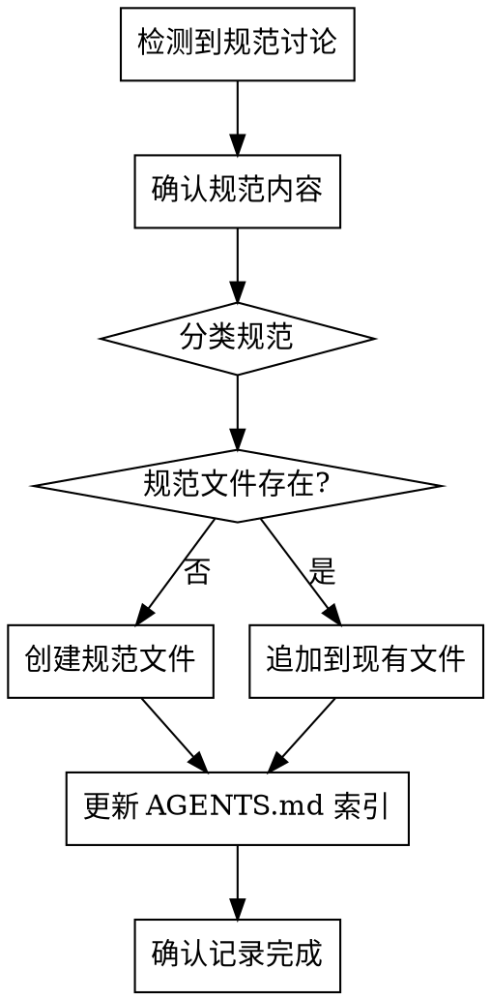

# Convention Tracking

## Overview

在任意对话中，当与用户讨论并确定项目规范时，自动记录到 `docs/conventions/` 目录。

**Core principle:** 规范应该被记录下来，而不是依赖记忆。

## When to Activate

检测到以下情况时主动记录：

- 用户明确表达偏好（"我希望..."、"以后都要..."、"请记住..."）
- 讨论确定了技术选型（"我们用 X 而不是 Y"）
- 约定了命名规范、代码风格
- 确定了流程或工作方式
- 用户纠正了之前的做法（"不要这样做，应该..."）

## Convention Categories

| 类别 | 文件 | 内容示例 |
|------|------|----------|
| 代码风格 | `docs/conventions/code-style.md` | 缩进、括号、空行规则 |
| 命名约定 | `docs/conventions/naming.md` | 变量、函数、文件命名 |
| Git 工作流 | `docs/conventions/git-workflow.md` | 分支策略、提交规范 |
| 测试规范 | `docs/conventions/testing.md` | 测试策略、覆盖率要求 |
| API 设计 | `docs/conventions/api-design.md` | 接口设计原则 |
| 其他 | `docs/conventions/<topic>.md` | 项目特定规范 |

## The Process



## Convention Format

每条规范使用以下格式：

```markdown
## [规范名称]

**来源:** [YYYY-MM-DD] / [功能开发名称或对话主题]
**状态:** 生效中 / 已废弃

### 规范内容

<具体规范描述>

### 背景

<为什么确定这个规范>

### 示例

**正确:**
```
<正确示例>
```

**错误:**
```
<错误示例>
```

---
```

## Creating New Convention Files

当需要创建新的规范文件时：

```markdown
# [类别名称] 规范

本文件记录项目的 [类别] 相关规范。

---

## [第一条规范]

...
```

## Integration with AGENTS.md

每次添加新规范时，检查 `AGENTS.md` 中是否有对应的链接：

1. 如果是新创建的规范文件 → 添加到 AGENTS.md 的规范表格
2. 如果是追加到现有文件 → 无需更新 AGENTS.md

## Key Principles

- **主动记录** — 不等用户要求，检测到规范讨论就记录
- **确认内容** — 记录前向用户确认规范内容是否准确
- **分类清晰** — 将规范放入正确的类别文件
- **保持索引** — 确保 AGENTS.md 索引是最新的

## Red Flags

- 规范讨论后没有记录
- 规范记录在错误的类别
- AGENTS.md 缺少新规范文件的链接
- 规范内容模糊，没有具体示例
