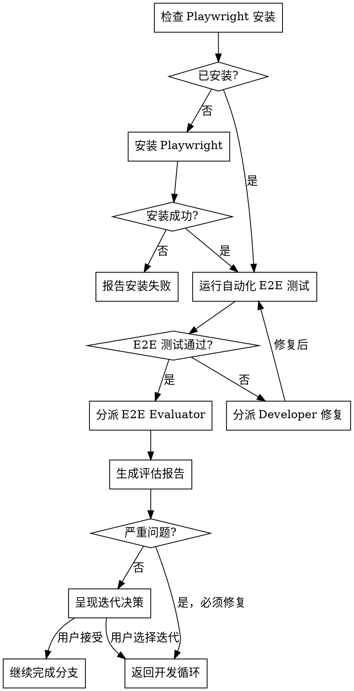

# End-to-End Evaluation

## Overview

在所有单元测试通过后，运行端到端测试并进行全面评估。不仅是自动化测试，还包括功能完整性、流程连贯性、交互体验等全方位评估。

**Core principle:** 端到端评估是发布前的最后一道质量关卡。

**Announce at start:** "I'm using the e2e-evaluation skill to perform comprehensive evaluation."

## When to Use

- `finishing-a-development-branch` 中，Step 1（验证单元测试）之后
- 用户显式请求端到端评估
- 重大功能完成后的验收测试

## Evaluation Dimensions

| 维度 | 评估内容 |
|------|----------|
| **功能完整性** | 所有功能是否按预期工作 |
| **流程连贯性** | 用户旅程是否顺畅，步骤是否合理 |
| **交互体验** | 响应速度、错误提示、边界处理 |
| **一致性** | UI 风格、命名、行为是否一致 |
| **可用性** | 潜在的用户困惑点、痛点 |

## The Process



## Step 1: Prerequisites Check

### 检查 Playwright 安装

```bash
npx playwright --version
```

### 如果未安装

1. 读取安装指南：https://raw.githubusercontent.com/microsoft/playwright-cli/refs/heads/main/README.md
2. 执行安装：
   ```bash
   npm init playwright@latest
   npx playwright install
   ```
3. 验证安装成功

## Step 2: Run Automated E2E Tests

```bash
npx playwright test
```

**如果测试失败:**
1. 分析失败原因
2. 分派 Developer 修复
3. 重新运行测试

## Step 3: Dispatch E2E Evaluator

使用 `evaluator-prompt.md` 模板分派评估子代理。

评估者将检查：
- 功能完整性
- 流程连贯性
- 交互体验
- 一致性
- 可用性问题

## Step 4: Generate Evaluation Report

将评估结果写入 `evaluation.md`，参考 `development-documentation/report-templates.md` 中的模板。

## Step 5: Iteration Decision

根据评估结果呈现决策：

```
端到端评估完成。

评估结果: ⭐⭐⭐⭐☆ (X.X/5)
- 🔴 严重问题: N
- 🟡 中等问题: N
- 🟢 轻微问题: N

建议: [发布建议]

您想要:
1. 进入迭代 — 修复问题，然后重新评估
2. 接受当前状态 — 继续完成分支
3. 只修复严重问题 — 快速修复后继续

请选择:
```

## Issue Severity

| 级别 | 定义 | 处理方式 |
|------|------|----------|
| 🔴 严重 | 影响核心功能，用户无法完成主要任务 | 必须修复，自动进入迭代 |
| 🟡 中等 | 影响用户体验，但不阻塞核心功能 | 建议修复，用户决定 |
| 🟢 轻微 | 优化建议，不影响功能 | 可选修复，记录到后续计划 |

## Integration

**Called by:**
- `finishing-a-development-branch` (Step 1.2)

**Outputs:**
- `evaluation.md` 评估报告
- 更新 `tests.md` 的 E2E 测试部分
